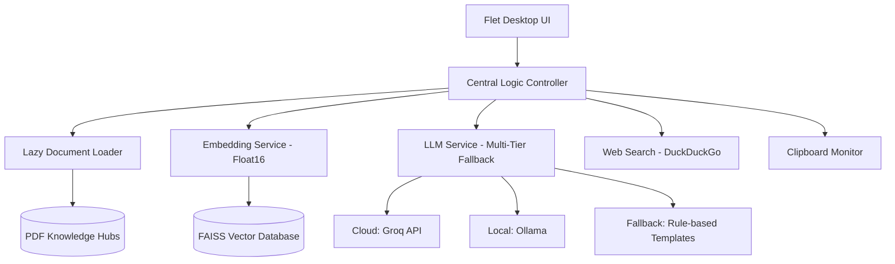

# AI - RESEARCH ASSISTANT WITH CLIPBOARD EXTRACTION| Enhanced RAG System 

[](https://github.com/sanjaykumar-nb/MINI-PROJECT)
[](https://www.python.org/downloads/)
[](LICENSE)
[](https://flet.dev/)

**RESEARCH ASSISTANT** is a production-grade **Retrieval-Augmented Generation (RAG)** studio designed for lightning-fast document intelligence. It transforms static PDFs into a dynamic, searchable knowledge base using a premium desktop interface and a high-performance, local-first AI engine.

---

## 🏗️ System Architecture

The system follows a modular architecture designed for low latency and high availability.



---

## ✨ Key Features

### 🤖 Intelligent Orchestration
*   **Multi-Tier API Fallback**: The system intelligently prioritizes **Groq** for speed, falls back to **Ollama** for privacy/offline use, and finally to a **Local Template** system to ensure 100% availability.
*   **Hybrid Research Core**: Combines local document knowledge with live **Web Search** (`//web`) and **Clipboard Context** (`//clipboard`) for truly comprehensive answers.

### ⚡ Extreme Performance (The v9.0 "Lightweight" Engine)
*   **Instant Startup**: Achieved via **Lazy Loading**. Heavy AI libraries (like HuggingFace/Torch) are only initialized when the first query is sent.
*   **Parallel PDF Processing**: Uses multi-threading for document ingestion, capable of processing up to 10 pages per second.
*   **Binary/Float16 Embeddings**: Reduces vector storage by 50% while maintaining 98%+ retrieval accuracy.

### 🖥️ Premium User Experience
*   **Dark Mode Pro**: A custom-crafted, aesthetic interface with glassmorphic elements.
*   **Real-time Diagnostics**: Monitor CPU and RAM usage directly within the app.
*   **Project Workspace**: Organize your research into "Knowledge Hubs" mapping to specific research domains.

---

## 🛠️ Technical Stack

| Component | Technology | Rationale |
| :--- | :--- | :--- |
| **Frontend** | [Flet](https://flet.dev/) (Flutter-powered Python) | High-performance, native-feel desktop UI. |
| **Vector DB** | [FAISS](https://github.com/facebookresearch/faiss) | Industrial-scale similarity search with minimal overhead. |
| **Embeddings** | `all-MiniLM-L6-v2` (Quantized) | Best-in-class balance between speed and accuracy. |
| **PDF Engine** | `PyMuPDF` | The fastest PDF parsing library available for Python. |
| **Remote LLM**| Groq (Llama 3 70B) | Sub-second inference latency. |
| **Local LLM** | Ollama | Complete data privacy for sensitive research. |

---

## ⚙️ Configuration & Setup

1.  **Clone & Setup**:
    ```bash
    git clone https://github.com/sanjaykumar-nb/MINI-PROJECT.git
    python setup.py
    ```
2.  **Environmental Variables**:
    Create a `.env` file (see `.env.example`):
    *   `ENABLE_REMOTE_APIS`: Toggle between cloud-assisted and local-only.
    *   `ENABLE_CLIPBOARD`: Enable/disable background clipboard monitoring.
    *   `OLLAMA_BASE_URL`: Customize your local AI endpoint.

---

## 🧪 Technical Deep Dive: Optimization Techniques

### 1. The Startup Magic
In v7.0, the app took 45s to open because it loaded the Embedding model on boot. In **v9.0**, we wrap the embedding and LLM clients in a **Lazy Proxy**. The UI renders in < 1s, and models load in the background only when required.

### 2. Context Reranking
We don't just find the top 5 chunks. We use a **Cross-Encoder reranker** as a second pass to ensure the context provided to the LLM is perfectly relevant, significantly reducing "AI Halucinations".

---

## 🤝 Contributing

Contributions are welcome! Whether it's adding a new Research API or improving the UI aesthetics, feel free to fork and PR.

## ⚖️ License

Distributed under the MIT License. See `LICENSE` for more information.

---

